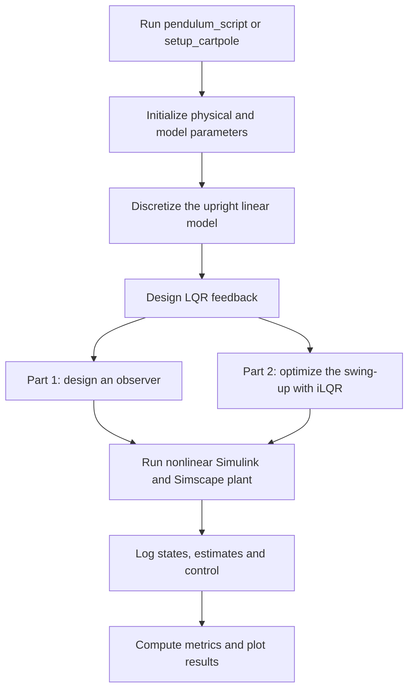
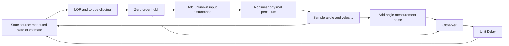

# How the complete project works

The project connects a mathematical model, a controller design, a nonlinear
physical simulation, and experiments that test their limits. Part 1 controls
a pendulum at a fixed pivot. Part 2 moves a cart to swing an initially hanging
pole upright and then balance it.

## 1. The execution flow

MATLAB performs the design calculations before simulation starts. Simulink
connects the signals and runs the controller at each sample. Simscape models
the mechanical plant continuously. The simulation is therefore a test of
controllers designed using simpler equations, rather than just a plot of
the linear model used to design them.

Opening a model alone previously did not create the required MATLAB variables.
The `InitFcn` callback now performs that recovery at model compilation, both
when updating the diagram and when starting simulation. The callback adds
the model's folder to the MATLAB path and calls `ensure_project_initialized`.
See MathWorks' [initialization function documentation](https://www.mathworks.com/help/simulink/ug/initialization-function.html).

The helper checks the active project part, variable availability, physical
structure fields, and gain/state dimensions. For example, an existing `param`
structure without `L` is incomplete. The helper recreates the complete setup
instead of letting the Cart and Pendulum solid blocks fail to evaluate
their dimensions. It also handles `m` being a structure in Part 1 and a scalar
in the Part 2 linearization.

The initializers do not call `sim`, load models, or plot. This prevents a
model initialization callback from recursively starting another simulation.
If the current part's parameters are already complete, initialization leaves
them in place. This preservation is essential when an experiment deliberately
changes `K`, `L`, `Ts`, the physical plant, or the actuator limits.

## 2. Part 1: the actuated pendulum

The two-state vector is

$$x = [\theta,\ \omega]^T,\qquad \omega=\dot\theta.$$

Here zero angle is upright. An angle of 180 degrees is hanging down. State
calculations use radians and radians per second; Simscape joint initial
conditions `p.theta0` and `p.omega0` use degrees and degrees per second in
the current Part 1 model. Use `deg2rad` when making the corresponding
initial observer state `xhat0`.

The shared setup distinguishes the physical system `p` from the controller's
model `m`. This lets an uncertainty experiment change the real plant without
redesigning the nominal controller. The full rod length is `p.l = 0.5 m`;
the point-mass distance used in the equations is `m.l = p.l/2 = 0.25 m`.
With mass $m_p$, pivot distance $\ell$ and damping $b$, the inertia is

$$J=m_p\ell^2.$$

The ideal nonlinear pendulum equations are

$$\dot\theta=\omega,$$
$$J\dot\omega=m_p g\ell\sin\theta-b\omega+u.$$

The sign of gravity is positive near upright: a small positive angle makes
the pendulum fall farther away. With zero torque, upright is unstable.
Damping dissipates motion, and hanging down is the stable resting position.

Near upright, $\sin\theta\approx\theta$, so

$$\dot x=A_cx+B_cu,$$
$$A_c=\begin{bmatrix}0&1\\g/\ell&-b/J\end{bmatrix},\qquad
B_c=\begin{bmatrix}0\\1/J\end{bmatrix},\qquad C=[1\ \ 0].$$

`pendulum_setup.m` forms these matrices and discretizes them with
`c2d(..., Ts, 'zoh')`, using a nominal sampling period of 0.02 seconds.

$$x_{k+1}=A_dx_k+B_du_k,\qquad y_k=Cx_k.$$

The zero-order-hold assumption means the input is held constant between
controller updates. For the continuous linear model,

$$A_d=e^{A_cT_s},\qquad B_d=\int_0^{T_s}e^{A_c\tau}B_c\,d\tau.$$

This exact linear discretization and the continuous nonlinear Simscape
integration serve different purposes. A discrete design can be stable near
upright yet behave differently at large angles, under saturation, or when
the sample period becomes large.

### LQR feedback

The discrete infinite-horizon LQR minimizes a quadratic cost on state
deviation and input effort:

$$\sum_{k=0}^{\infty}(x_k^TQx_k+u_k^TRu_k).$$

`dlqr` computes a gain $K$ and the nominal feedback is

$$u_k=-Kx_k.$$

The baseline uses Bryson-style weights,

$$Q=\operatorname{diag}(1/\theta_{\max}^2,1/\omega_{\max}^2),\qquad
R=1/u_{\max}^2,$$

with representative scales of 180 degrees, 2 rad/s and 2.5 N m. Increasing
a diagonal weight in $Q$ makes deviation in that state more costly.
Increasing $R$ makes control effort more costly. These are cost weights;
they do not impose a hard bound on the angle or torque.

The MATLAB Function controller clips its command to `[umin, umax]`, normally
`[-2.5, 2.5] N m`. Experiments can set these bounds to infinity to study the
unconstrained controller. The local LQR stability condition is that all
eigenvalues of $A_d-B_dK$ lie inside the unit circle. It is not a global
guarantee for a saturated nonlinear pendulum.

### The observer

The model exposes both angle and velocity for evaluation, but the observer
estimates them using only the angle measurement and known commanded torque.
Its predictor-form update is

$$\hat x_{k+1}=A_d\hat x_k+B_du_k+L(y_k-C\hat x_k).$$

The prediction uses the mathematical model. The correction uses the
innovation, or measurement minus predicted measurement. For the ideal
linear noiseless case, estimation error $e_k=x_k-\hat x_k$ satisfies

$$e_{k+1}=(A_d-LC)e_k.$$

`pendulum_setup` checks observability with `[C; C*Ad]` and chooses $L$ using
`place(Ad', C', obs_poles)'`. Its baseline observer poles are the dominant
controller pole magnitude raised to powers 5 and 7.5. This makes the nominal
observer decay faster than the controller. Faster estimation can improve
initial convergence but also amplify measurement noise and produce a larger
control transient.

The embedded observer wraps angle innovation to the shortest angular
distance and wraps its predicted angle into `[-pi, pi)`. Equivalent angles
separated by a full revolution should not create a large innovation.
The Unit Delay stores the estimate used on the next sample and supplies
the initial estimate `xhat0`.

### Signal wiring, disturbances and outputs

In the current canonical model:

- `use_observer = true` feeds the estimated state to the controller; `false`
  selects the measured Simscape state. The observer still runs in parallel.
- `u_noise` scales a random torque added **to the plant input**. The observer
  receives the known command before this addition, so it does not know the
  random disturbance.
- `y_noise` scales random angle noise added to the observer measurement. It
  changes the information available to the observer, rather than physically
  pushing the pendulum.
- The disturbance sources update every `Ts`. For a zero-mean uniform signal
  on `[-a,a]`, variance is $a^2/3$, which the noise experiments use in their
  linear covariance predictions.

The physical input disturbance is added after command clipping. Thus the
total plant torque can exceed the clipped command. `out.u_sim` logs the
command before that disturbance addition.

The main logged signals are `out.theta_sim`, `out.omega_sim`,
`out.theta_hat`, `out.omega_hat` and `out.u_sim`. Angles in these logs are
radians; the experiment scripts convert them to degrees for plots.
Inspect both the real and estimated states, estimation error, torque,
saturation fraction, and sustained final behavior. Passing through upright
once is different from balancing there.

## 3. What each Part 1 experiment teaches

All ten scripts use the canonical `actuated_pendulum` model. They call
`pendulum_setup`, specify conditions, run simulations and report metrics.

| Script | What changes | What to learn from the result |
| --- | --- | --- |
| `simscape_open_loop.m` | Controller gain set to zero | Compare mechanical simulation with the nonlinear `ode45` equation; observe the fall from upright |
| `lqr_evaluation.m` | Initial angle and velocity; measured-state feedback without saturation | Explore nonlinear recovery under ideal unlimited actuation |
| `qr_sweep.m` | State and effort weights through Bryson scales | Compare settling, control effort, peak torque and response to an initial velocity |
| `sampling_time.m` | Sample period, with rediscretization and redesigned gains | Separate controller behavior, observer convergence and combined-loop behavior |
| `actuator_limits.m` | Torque limits and initial state | See how saturation reduces the region that can recover |
| `observer_poles.m` | Observer decay rate and initial estimate | Compare convergence, overshoot, torque transients and sensitivity to noise |
| `measurement_noise.m` | Angle noise and observer speed | Compare measured fluctuations with linear covariance predictions |
| `input_disturbance.m` | Unknown physical torque disturbance | Study disturbance rejection and deviations from the ideal linear predictions |
| `model_uncertainty.m` | Physical mass, length or damping with fixed nominal controller | Compare local eigenvalue stability predictions with nonlinear behavior |
| `alternative_estimation.m` | Observer versus direct/filtered finite differences | Compare model-based estimation with noisy numerical differentiation |

For a pendulum at rest, the magnitude of torque needed to oppose gravity is
$m_pg\ell|\sin\theta|$. If the actuator limit is smaller than $m_pg\ell$,
a representative static holding angle is

$$\theta_{\mathrm{hold}}=\arcsin(u_{\max}/(m_pg\ell)).$$

This static calculation is useful intuition, but velocity and controller
dynamics also affect recovery. It is not a complete nonlinear capture region.

The alternative estimators approximate angular velocity by a backward
difference of measured angles. Differentiation magnifies noise because
successive measurement errors are divided by `Ts`. A low-pass filter
reduces that noise at the cost of delay. The experiment implements these
estimators through alternate `Ad`, `Bd` and `L` matrices in the same observer
block, which is why initialization must preserve deliberately replaced gains.

Some experiment rows are deliberately unsuccessful. An `ok = 0`, a final
nonzero angle, or a `NaN` settling time can be a valid result about saturation,
slow sampling or model uncertainty. The validation suite checks that scripts
execute; it does not assert that every deliberately difficult case balances.

`ode_script.m` is the additional standalone mathematical demonstration. It
uses `ode45` with tight tolerances to compare nonlinear releases from exact
upright, small positive/negative angle perturbations, and an initial velocity.
It also plots the upright linearization and prints times to reach increasing
angles. Exact upright with exactly zero velocity remains an equilibrium in
the ideal equations; nearby initial states fall away. The linear approximation
is useful initially and becomes inaccurate as the angle grows. This script
does not run the Simulink controller, and exports `open_loop.png`.

## 4. Part 2: the cart-pole

The state is

$$x=[p,\ v,\ \theta,\ \omega]^T.$$

Here $p$ is cart position, not the Part 1 parameter structure of the same
letter. $v=\dot p$, $\omega=\dot\theta$, zero angle is upright, and `+/-pi`
is hanging down. `param.theta0` is given to the Simscape joint in degrees;
the optimizer's `x0` uses radians. The baseline initial state is
`[0; 0; pi; 0]`.

The physical parameters are `param.M`, `param.m`, `param.L`, `param.bc`
and `param.bp`. Initial conditions are `param.p0`, `param.v0`,
`param.theta0` and `param.omega0`. The optimizer's structure `model` uses
`ell = param.L/2`. It contains the same masses, damping and gravity.

`cartpole_dynamics.m` solves the coupled acceleration equations:

$$\begin{bmatrix}M+m&-m\ell\cos\theta\\
-m\ell\cos\theta&m\ell^2\end{bmatrix}
\begin{bmatrix}\ddot p\\\ddot\theta\end{bmatrix}
=\begin{bmatrix}u-b_cv-m\ell\sin\theta\,\omega^2\\
mg\ell\sin\theta-b_p\omega\end{bmatrix}.$$

The off-diagonal terms express the coupling: cart acceleration changes pole
rotation, and pole rotation changes cart motion. The cart has a single force
actuator, so the two mechanical coordinates cannot be commanded independently.
The equations return `[v; acceleration; omega; angular_acceleration]`.

### Upright balancing LQR

`initialize_cartpole.m` forms the four-state continuous linearization at
upright, discretizes it at `Ts = 0.01 s`, and uses `dlqr` to compute `K_lqr`.
State weights normalize cart travel, speed, angle and angular speed; force
effort is weighted with `R_lqr = 1/Fmax^2`, with `Fmax = 20 N`.

The balancing law is

$$u=\operatorname{clip}(-K_{\mathrm{lqr}}x,-F_{\max},F_{\max}).$$

The measured angle is wrapped before balancing. This LQR is designed near
upright. It is not the algorithm that plans a swing from the hanging state.

### iLQR swing-up planning

The baseline horizon is `T = 4.18 s`, so `N = 418` samples. A bounded 1.3 Hz
sinusoidal force provides an initial guess. The optimizer improves that guess
using the nonlinear model and a finite-horizon cost:

$$J=\tfrac12x_N^TQ_fx_N+\tfrac12\sum_{k=0}^{N-1}
(x_k^TQx_k+u_k^TRu_k).$$

The target state is zero in these coordinates. `Q` penalizes state error,
`R` penalizes force, and `Qf` strongly weights ending in a useful position
with small angle and velocities. The cost uses the raw planned angle;
wrapped angle errors are used in feedback to avoid jumps of `2*pi`.

The files have distinct jobs:

| File | Calculation |
| --- | --- |
| `cartpole_dynamics.m` | Continuous nonlinear state derivative |
| `discrete_step.m` | One sample of nonlinear propagation with fourth-order Runge-Kutta |
| `linearize_trajectory.m` | Central finite-difference Jacobians of that discrete propagation at each nominal state and force |
| `trajectory_cost.m` | Running plus terminal quadratic cost |
| `backward_lqr.m` | Backward quadratic cost-to-go recursion; feedforward corrections and feedback gains |
| `forward_pass.m` | Nonlinear rollout under a proposed correction, wrapped angle deviations and force clipping |
| `ilqr.m` | Repeated linearization, backward pass, line search, acceptance and stopping |
| `initialize_cartpole.m` | Problem parameters, initial guess, optimization and nominal checks |
| `setup_cartpole.m` | Main launcher: initialize, simulate, report measured behavior and plot |

At each iteration iLQR approximates local deviations by

$$\delta x_{k+1}\approx A_k\delta x_k+B_k\delta u_k.$$

The backward pass computes a feedback matrix $K_k$ and feedforward
correction $d_k$. The nonlinear forward pass tries

$$u_k^{\mathrm{new}}=\operatorname{clip}
(\bar u_k+\alpha d_k-K_k(x_k^{\mathrm{new}}-\bar x_k),-F_{\max},F_{\max}).$$

The line search tries decreasing values of $\alpha$ and accepts only a lower
finite cost. Iteration stops when no tested correction improves the cost,
the improvement or input change is small, or 60 iterations have been tried.
The final feedback gains are recomputed around the accepted trajectory.

The feedforward sign in `backward_lqr` follows stationarity of this positive
quadratic cost: `d = -(G \ (R*U + B'*s))`. Its comment records the difference
from the sign printed in the original handout. The forward pass uses
`+ alpha*d`, so changing this sign independently changes the descent direction.

iLQR is a local optimizer. Its outcome depends on the model, weights,
horizon and starting guess. Force is explicitly clipped, but quadratic state
weights alone do not enforce a hard cart-travel constraint.

### Online trajectory tracking and switching

The optimized arrays have shapes:

- `Xnom`: `4 x (N+1)`, planned states including the initial and terminal state.
- `Unom`: `1 x N`, planned force commands.
- `Knom`: `1 x 4 x N`, time-dependent tracking feedback.
- `K_lqr`: `1 x 4`, upright balancing feedback.

During the simulation, the embedded controller uses the current time to
select the nominal sample and applies

$$u_k=\operatorname{clip}(\bar u_k-K_k(x_k-\bar x_k),-F_{\max},F_{\max}).$$

It wraps the angular component of the state error with
`atan2(sin(error), cos(error))`. The online controller uses the accepted
nominal force and feedback, not the optimizer's intermediate feedforward
corrections.

The canonical model reads `capture = [p_limit, v_limit, theta_limit, omega_limit]`
from the initializer. The defaults are 0.60 m, 1.50 m/s, 20 degrees and
0.75 rad/s. All four conditions must hold together before switching to LQR.
The controller latches into LQR mode for the rest of that simulation.
It does not automatically plan another swing-up if a later large push makes
the pole fall.

If the planning horizon ends before measured capture, the implementation
continues tracking the terminal planned state using the last planned force
and gain. The default measured capture occurs after the 4.18-second horizon.
The simulation continues to `T+8 = 12.18 s` to observe balancing.

The main model's disturbance input is a Constant set to zero. The physical
subsystem routes its external disturbance through an External Force and
Torque block. A force on the pole can cause both translation and rotation,
so it is not automatically equivalent to adding the same force to the cart
actuator. Baseline validation uses the unchanged zero-disturbance setting.

## 5. Reading the Part 2 results

`out.x` contains cart position, cart velocity, pole angle and pole angular
velocity. `out.u` contains the commanded cart force. The launcher compares
nominal and Simscape trajectories in five plots.

The nominal trajectory is the plan calculated with `discrete_step`; the
Simscape trajectory is the measured result under sampled feedback. Tracking
error can remain small during much of the swing yet become consequential
near the end. This is why validation checks the measured state and final
balancing, not just a low nominal optimization cost.

The current defaults reach measured capture at about 6.4 seconds and stay
near upright for the final second. The selected final settling box is
`|p| <= 0.05 m`, `|v| <= 0.10 m/s`, `|theta| <= 2 deg`, and
`|omega| <= 0.10 rad/s`.

Measured peak cart travel is about 1.099 m, whereas the planned peak is
about 0.585 m. The configured target is 1.0 m. The launcher now reports the
measured peak and warns about this exceedance. Successful startup and
balancing do not establish compliance with that travel target. Improving it
requires controller/trajectory tuning or an optimizer that enforces path
constraints; this branch preserves the colleagues' current control design.

## 6. Where the physical simulation fits

Simscape's Revolute Joint permits pole rotation. Part 2 additionally uses
a Prismatic Joint for cart translation. Solid and Rigid Transform blocks
describe bodies and their geometry. Mechanism Configuration supplies gravity;
solver blocks integrate the coupled mechanical equations. Simulink-PS and
PS-Simulink converters connect numeric signals to physical ports.

The Digital Clock and zero-order holds express the sampled controller.
MATLAB Function blocks calculate the feedback and observer equations.
To Workspace blocks log the values needed for plots and checks. No controller
can run reliably if the geometric dimensions, masses, damping, initial state,
sample time or gains referenced by those blocks are missing.

The numbered copies remain useful for historical comparison, but the canonical
models are the ones paired with the current experiment scripts. In particular,
the legacy pendulum copy lacks the current state-source switch and adjustable
noise gains, and its disturbance wiring differs. Use the canonical model when
interpreting the ten colleagues' experiments.

## 7. A useful order for understanding the code

1. Run `simscape_open_loop` and connect the falling motion to the pendulum
   equation and upright instability.
2. Read `pendulum_setup`, identify $A_c,B_c,A_d,B_d,Q,R,K$, and run
   `lqr_evaluation` and `qr_sweep`.
3. Read the embedded observer update, then run `observer_poles` and
   `measurement_noise`. Distinguish physical state from estimated state.
4. Run `sampling_time`, `actuator_limits`, `input_disturbance` and
   `model_uncertainty`. Explain why local linear stability does not settle
   every nonlinear scenario.
5. Read `cartpole_dynamics` and `discrete_step`, then trace one iLQR iteration
   through linearization, backward recursion, forward rollout and line search.
6. Run `setup_cartpole`, compare its five plots, and inspect when measured
   capture actually occurs.
7. Run `verify_project(true)` to reproduce the startup regression checks and
   all ten scripts. Inspect `output/validation/latest.log` for individual
   experiment results and `latest.json` for the check summary.

For an exam, practice deriving the pendulum linearization, ZOH discretization,
observer error equation and feedback stability conditions. Then explain why
LQR weights are not hard constraints, why velocity matters for capture, why
finite differences amplify noise, and why iLQR needs both a backward local
calculation and a forward nonlinear simulation.
